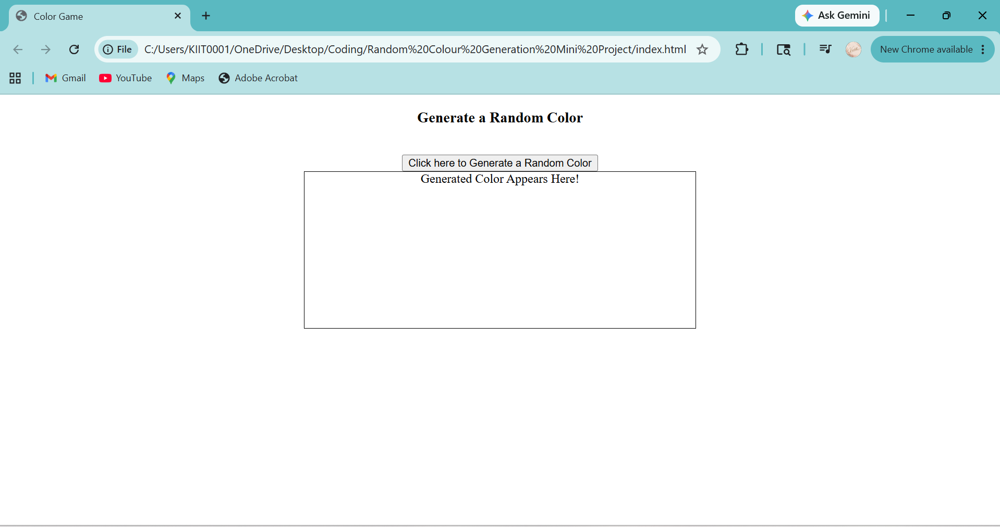
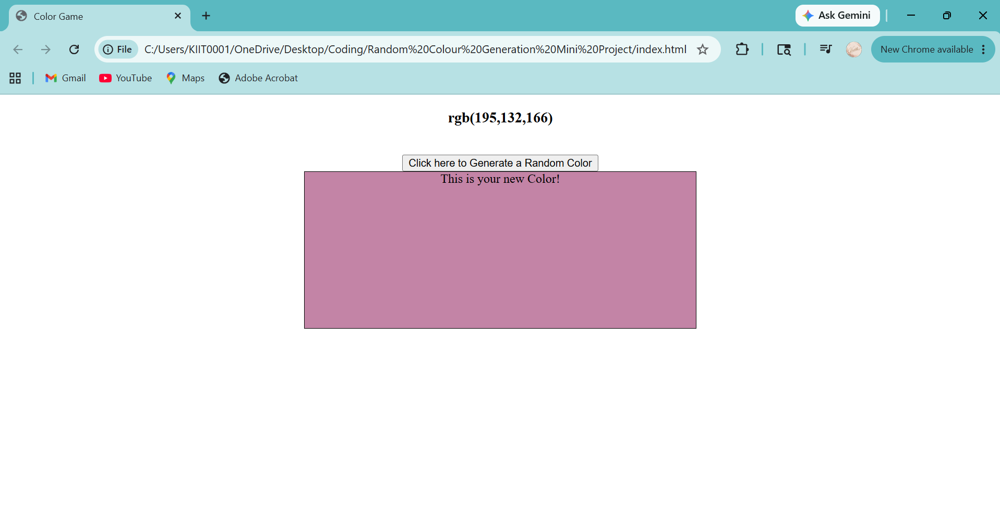

# 🎨 Random Color Generator

A simple web application built using HTML, CSS, and JavaScript that generates a random RGB color every time the user clicks a button.

---

## 🚀 Features

* Generate random RGB colors
* Update the background color dynamically
* Display the generated RGB value
* Interactive and beginner-friendly JavaScript project

---

## 🛠️ Technologies Used

* HTML5
* CSS3
* JavaScript (ES6)

---

## 📚 Concepts Practiced

* DOM Manipulation
* Event Listeners
* Functions
* Random Number Generation
* Template Literals
* Dynamic Styling

---

## 📸 Screenshots

### Initial Interface



### Generated Color Example



---

## 📂 Project Structure

```text
random-color-generator/
│
├── index.html
├── style.css
├── app.js
├── Initial.png
├── Generated-color.png
└── README.md
```

---

## 🔧 How to Run

1. Clone the repository

```bash
git clone https://github.com/your-username/random-color-generator.git
```

2. Open the project folder

3. Run `index.html` in any modern web browser

---

## 🌱 Future Improvements

* Copy generated color to clipboard
* Generate HEX colors
* Save favorite colors
* Add dark/light mode
* Display color history

---

## 👨‍💻 Author

Vriddhi Mishra

Learning Web Development and building projects with Creativity.

